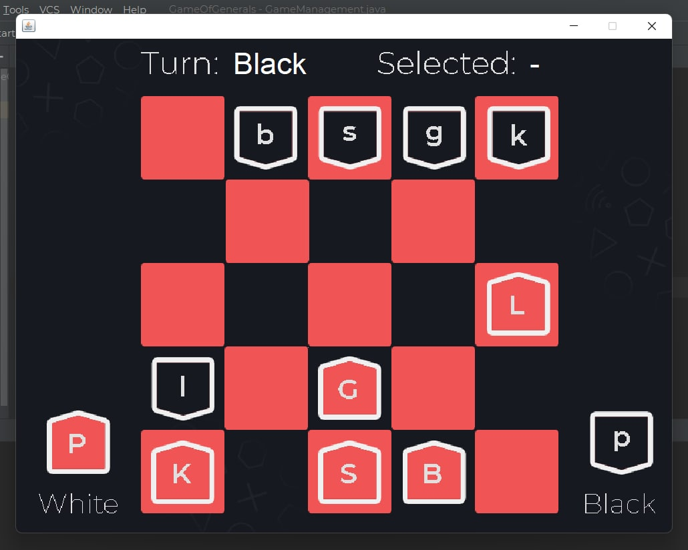

# Game of the Generals — Simplified
## Java + JavaFX implementation

### Features
- JavaFX-based graphical board and piece rendering  
- Hidden-piece mechanics (opponent sees only move but not piece rank)  
- Turn-based local play (two players on the same machine)

A small, playable simplified version of *Game of the Generals* (inspired by the classic board game). Built with Java and JavaFX for an easy GUI-based single-player or local two-player experience. The project focuses on core mechanics: hidden piece ranks, move/attack resolution, and a simple UI to learn the rules.
